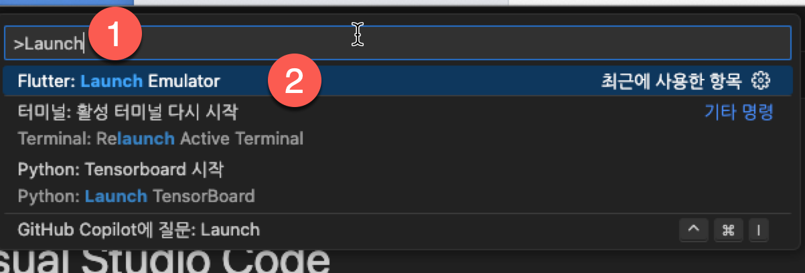
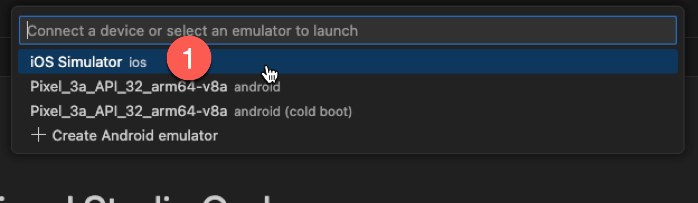
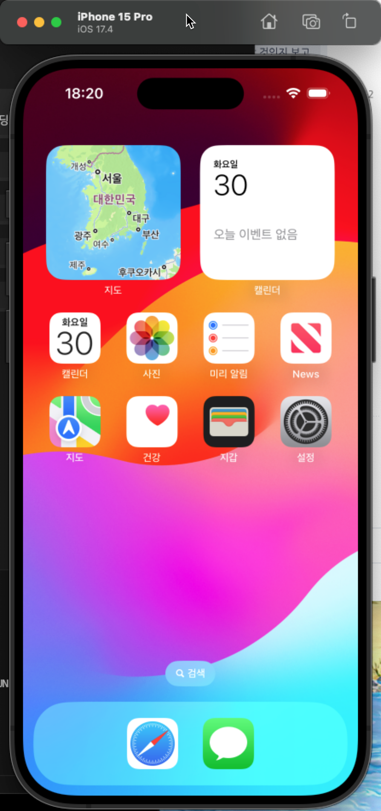
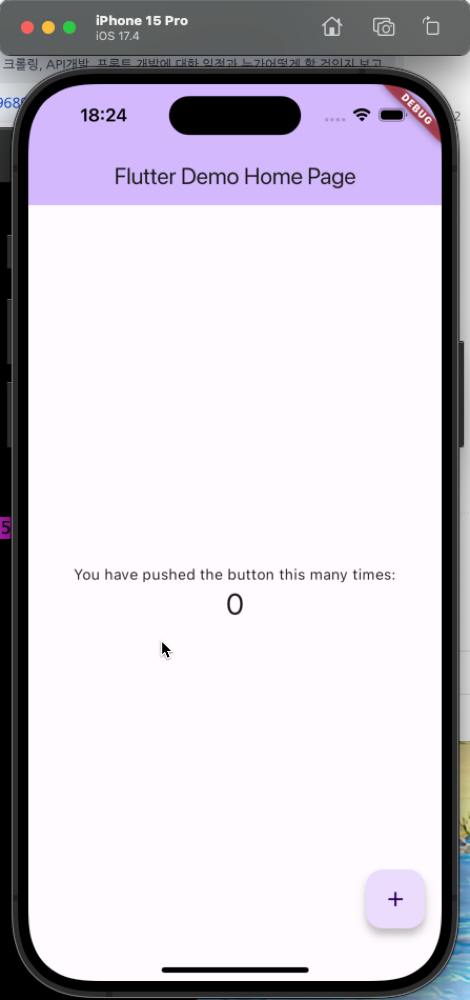

# flutter HELLO

- 작성자 : 김성박 (urstory@gmail.com)

---

# flutter 개발환경 설치

- 생략

---

# flutter doctor

```
❯ flutter doctor
Doctor summary (to see all details, run flutter doctor -v):
[✓] Flutter (Channel stable, 3.19.4, on macOS 14.4.1 23E224 darwin-arm64 (Rosetta), locale ko-KR)
[✓] Android toolchain - develop for Android devices (Android SDK version 33.0.0)
[✓] Xcode - develop for iOS and macOS (Xcode 15.3)
[✓] Chrome - develop for the web
[✓] Android Studio (version 2022.1)
[✓] IntelliJ IDEA Ultimate Edition (version 2023.3.2)
[✓] VS Code (version 1.88.1)
[✓] Connected device (2 available)
[✓] Network resources

• No issues found!
```

---

# flutter 개발 환경 조심해야할 부분

- 특정 버전에서 멈춰놓고 개발한다.
- 함께 버전업 한다.
- 다른 개발자들 보다 버전이 높다면 다운그레이드 한다.

---

# flutter 프로젝트 생성

```
flutter create [프로젝트이름]
cd 프로젝트이름
flutter run
```

- mac이나 크롬에서 실행한다고 한다. 에뮬레이터가 있다면 에뮬레이터로 실행할 수 있다.

---

# 에뮬레이터 실행


- [flutter] Unable to boot simulator 해결 방법
- 이 Mac에 관하여 > 저장 공간 > 관리 > 개발자 > xcode 프로젝트 빌드 파일 > xcode 캐시 항목을 선택하시고 삭제

---

# flutter 프로젝트 생성 및 Visual Studio Code에서 작업

- flutter create firstapp
- cd firstapp
- code .

---

# iOS 에뮬레이터 실행



---

# iOS 에뮬레이터 실행



---

# iOS 에뮬레이터 실행



---

# flutter 앱 실행

터미널에서 다음과 같이 실행

```
flutter run
```

---

# 실행결과 보기



---

# 끝