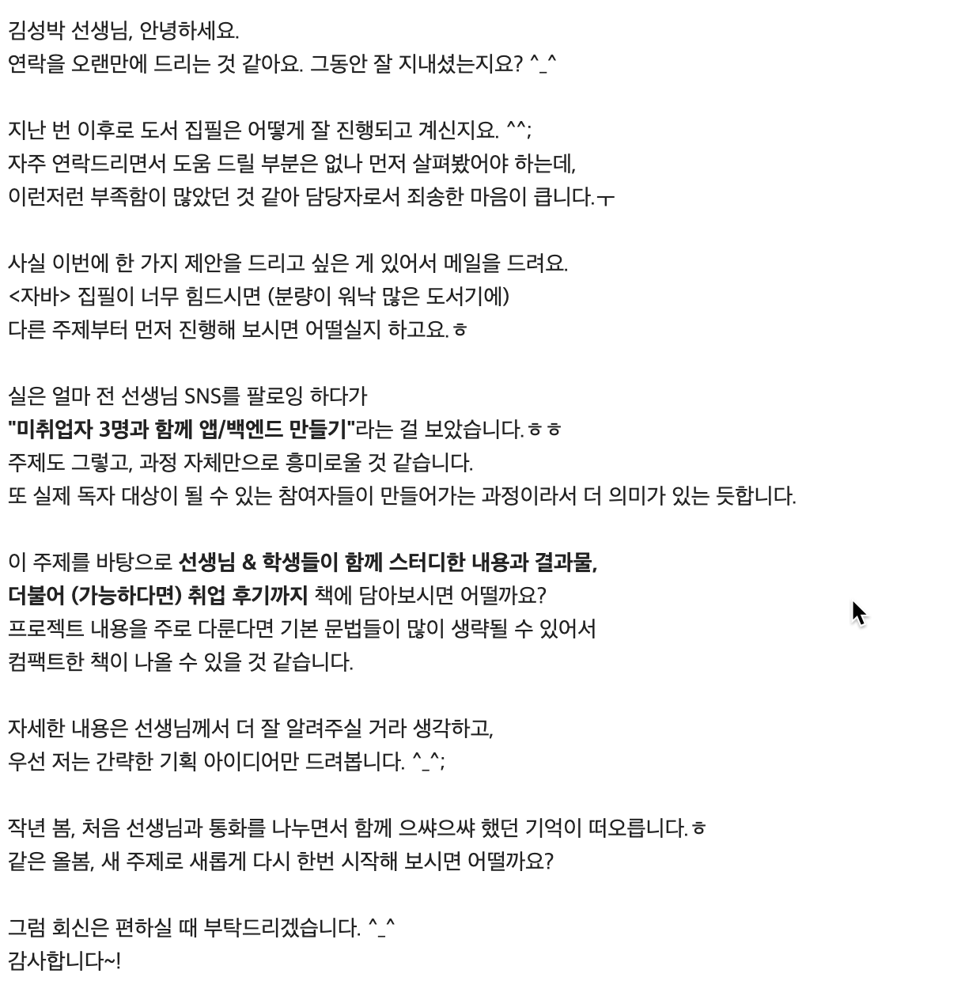

# 참여자

- 스터디 리더 : 김성박(토토)
- 스터디원 : 권미리(메이리), 변지혜(윈), 장세계(월드), 정다인(다이노)

---

# 자기소개하기

---

# 2024 스터디

- 우리는 실제 서비스되는 앱과 백엔드를 개발함으로써 서로 성장하는 기쁨을 얻는다.
- 플러터, Java, Spring Boot를 이용해 앱과 백엔드를 개발한다.
- 스터디 구성원 모두는 플러터, Java, Spring Boot에 대한 기술적인 내용을 이해하려 애쓰고, 활용할 수 있도록 한다.
- 가상의 회사를 모두의 이름으로 설립하고, 실제 개발/배포/운영을 하고 그 과정을 문서화한다.

---

---

# 이런 취지에 맞게 스터디 이름 정하기

---

# 오프라인 규칙 정하기 

- 50분 스터디, 최소 10분 휴식

---

# 온라인 규칙 정하기 

- 매일 매일 대화한다.

---

# 탈퇴 및 강퇴 규칙 정하기

- 스스로 언제나 탈퇴할 수 있다. 탈퇴하거나 강퇴하기까지 작성된 스터디 자료, 코드는 모두의 자산으로써 탈퇴자나 강퇴자는 자신의 소유권을 요청할 수 없다.
- 스터디 오프라인에 반복적으로 지각하거나 (몇회로 할지 이부분은 함께 결정), 스터디를 소홀히 하거나 (이부분에 대해서도 함께 결정) 할 경우 강퇴한다.

---

# 스터디 계획

---

## 플러터 스터디
- 플로터 스터디
- 플러터 미니 프로젝트

---

## 백엔드 스터디
- 백엔드 스터디
- 백엔드 미니 프로젝트

---

## 프로젝트
- 기획 (요구사항 정의, 페이퍼 프로토타이핑)
- API 설계
- 앱과 백엔드 개발
- 출시
- 운영

---

# 끝

