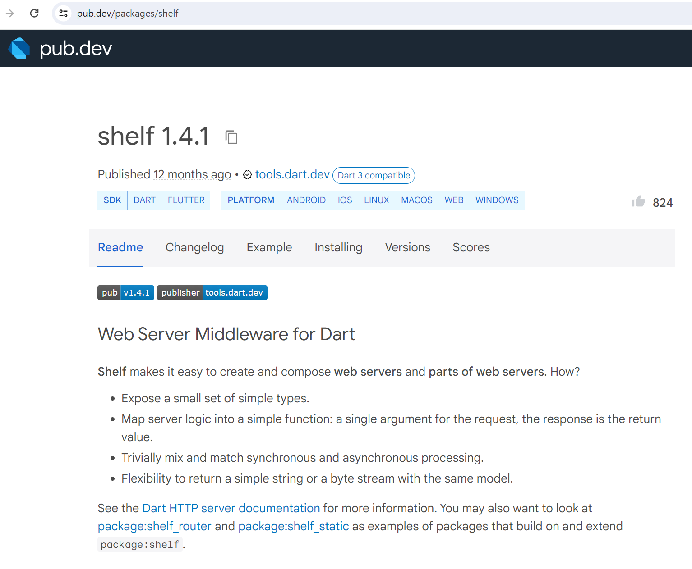
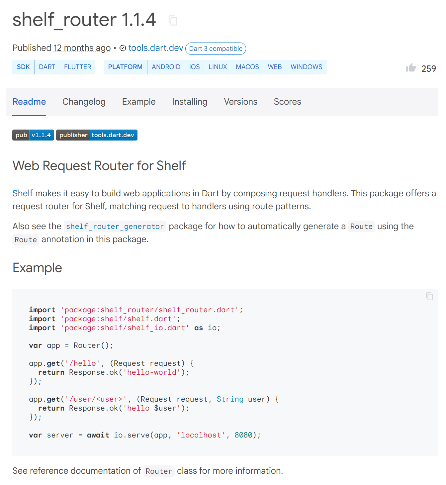
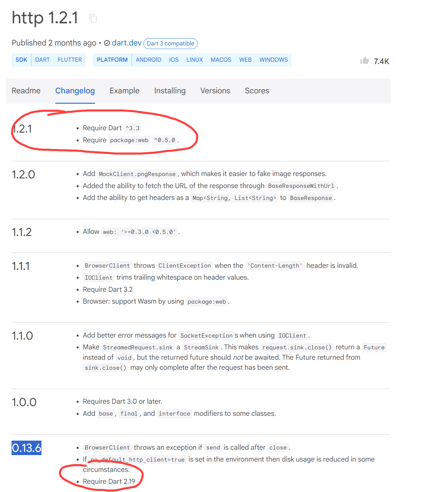

# Dart를 이용해 Web API 구현하기

김성박(urstory@gmail.com), 강경미(carami@nate.com)

---

Dart에서 웹 API 서버를 개발하기 위해 가장 많이 사용되는 라이브러리는 `shelf` 입니다. `shelf`는 간단한 미들웨어 기반의 웹 서버 개발을 지원하며, 라우팅, CORS, JWT 인증 등의 다양한 플러그인을 추가하여 확장할 수 있습니다. Dart는 Spring Boot와 같은 포괄적인 프레임워크를 기본적으로 제공하지 않지만, `shelf`와 같은 라이브러리를 조합하면 강력한 웹 서버를 구축할 수 있습니다.

---

### 프로젝트 생성

```
dart create dart_api_server
cd dart_api_server
```

---

### 필요한 패키지 설치

먼저, `pubspec.yaml` 파일을 생성하고 필요한 의존성을 추가해야 합니다.

```yaml
name: dart_api_server
description: A sample command-line application.
version: 1.0.0
# repository: https://github.com/my_org/my_repo

environment:
  sdk: ">=2.19.5 <3.0.0"

dependencies:
  shelf: ^1.4.1
  shelf_router: ^1.4.1
  shelf_static: ^1.4.1

dev_dependencies:
  lints: ^2.0.0
  test: ^1.21.0
```

---

이 의존성은 `shelf` 핵심 라이브러리, 라우팅을 위한 `shelf_router`, 정적 파일을 서빙하기 위한 `shelf_static`을 포함하고 있습니다.



---



---

### Shelf용 웹 요청 라우터

Shelf는 요청 핸들러를 조합하여 Dart에서 웹 애플리케이션을 쉽게 구축할 수 있도록 해줍니다. 이 패키지는 라우트 패턴을 사용하여 요청을 핸들러에 매칭하는 Shelf용 요청 라우터를 제공합니다.

또한, 이 패키지에서 Route 어노테이션을 사용하여 라우트를 자동으로 생성하는 방법에 대해서는 `shelf_router_generator` 패키지를 참조하세요.

---

### 예제

```dart
import 'package:shelf_router/shelf_router.dart';
import 'package:shelf/shelf.dart';
import 'package:shelf/shelf_io.dart' as io;

var app = Router();

app.get('/hello', (Request request) {
  return Response.ok('hello-world');
});

app.get('/user/<user>', (Request request, String user) {
  return Response.ok('hello $user');
});

var server = await io.serve(app, 'localhost', 8080);
```

---

이 Dart 코드는 `shelf`, `shelf_router`, 및 `shelf_io` 패키지를 사용하여 간단한 웹 서버를 구축하는 방법을 보여줍니다.

---

### 코드 구성 요소

1. **패키지 임포트**:
   ```dart
   import 'package:shelf_router/shelf_router.dart';
   import 'package:shelf/shelf.dart';
   import 'package:shelf/shelf_io.dart' as io;
   ```
   - `shelf_router`, `shelf`, `shelf_io` 패키지를 임포트합니다. `shelf_io`는 `io`라는 별칭으로 임포트되어, 이 패키지의 기능을 `io` 접두어를 사용하여 참조할 수 있게 합니다.

---

2. **라우터 객체 생성**:
   ```dart
   var app = Router();
   ```
   - `Router` 클래스의 인스턴스를 생성하여 `app` 변수에 할당합니다. `var` 키워드는 변수의 타입을 컴파일러에 의해 자동으로 추론하도록 합니다.

---

3. **라우트 정의**:

   ```dart
   app.get('/hello', (Request request) {
     return Response.ok('hello-world');
   });

   app.get('/user/<user>', (Request request, String user) {
     return Response.ok('hello $user');
   });
   ```

---

- `app` 객체의 `get` 메서드를 사용하여 두 개의 HTTP GET 라우트를 정의합니다.
- 첫 번째 라우트는 `/hello` 경로에 대응하고, 요청이 들어올 때 "hello-world"라는 텍스트를 담은 응답을 반환합니다.
- 두 번째 라우트는 `/user/<user>` 경로에 대응하고, 경로 변수 `<user>`를 통해 사용자 이름을 동적으로 받습니다. 요청이 들어올 때 "hello [사용자 이름]" 형태의 텍스트를 응답합니다.
- 람다 함수 `(Request request) => Response.ok('hello-world')`는 `Request` 객체를 입력받고 `Response` 객체를 반환합니다. 이는 Dart에서 화살표 함수를 사용한 간결한 함수 표현 방식입니다.

---

4. **서버 시작**:
   ```dart
   var server = await io.serve(app, 'localhost', 8080);
   ```
   - `io.serve` 함수는 비동기적으로 서버를 시작하며, `await` 키워드를 사용하여 비동기 호출이 완료될 때까지 기다립니다. 이는 Dart의 비동기 프로그래밍 기능을 활용한 것입니다.
   - `app` 라우터를 `localhost`의 `8080` 포트에서 실행하도록 설정합니다.

---

### Dart의 특징적인 문법

- **비동기 처리 (`async` / `await`)**: Dart에서는 비동기 작업을 처리하기 위해 `async`와 `await`를 사용합니다. `await` 키워드는 `Future` 객체의 완료를 기다리는 데 사용되며, 해당 작업이 완료될 때까지 코드의 실행을 일시 중지합니다.
- **람다 표현식**: Dart에서는 `=>`를 사용하여 짧은 함수를 간결하게 표현할 수 있습니다. 이는 함수의 바디가 단일 표현식으로 구성될 때 유용합니다.
- **문자열 보간**: `$` 기호를 사용하여 문자열 내에 변수 값을 직접 삽입할 수 있습니다. 이는 코드의 가독성을 높이고 문자열 조합을 간편하게 합니다.

이 코드는 Dart와 `shelf` 라이브러리를 사용하여 RESTful API를 구현하는 간단하면서도 효과적인 예시를 제공합니다.

---

### 참조

- 이 패키지가 라우터를 생성할 수 있는 패키지 `shelf`.
- 소스 코드 어노테이션을 사용하여 라우터를 생성할 수 있는 `shelf_router_generator` 패키지.
- 제3자 튜토리얼 creativebracket.com:
  - 비디오: `shelf_router`로 RESTful 웹 API 구축하기
  - 샘플: 튜토리얼의 저장소

---

### 서버 코드

`bin/dart_api_server.dart.dart`

```dart
import 'dart:io';
import 'package:shelf/shelf.dart';
import 'package:shelf/shelf_io.dart' as io;
import 'package:shelf_router/shelf_router.dart';

// 라우터 설정
Router configureRoutes() {
  final router = Router();

  // GET: /hello
  router.get('/hello', (Request request) {
    return Response.ok('Hello, World!');
  });

  // 동적 라우트, 예: /hello/<name>
  router.get('/hello/<name>', (Request request, String name) {
    return Response.ok('Hello, $name!');
  });

  return router;
}
```

---

```dart
void main(List<String> args) async {
  final ip = InternetAddress.anyIPv4;
  final port = int.parse(Platform.environment['PORT'] ?? '8080');

  final handler = const Pipeline()
      .addMiddleware(logRequests()) // 요청 로깅
      .addHandler(configureRoutes());

  final server = await io.serve(handler, ip, port);
  print('Serving at http://${server.address.host}:${server.port}');
}
```

이 코드는 8080 포트에서 서버를 실행하고, `/hello` 및 `/hello/<name>` 경로에 대한 요청을 처리하는 기본 라우터를 설정합니다.

---

### 서버 실행

코드를 완성한 후, 다음 명령어로 서버를 실행할 수 있습니다:

```bash
dart run bin/server.dart
```

이제 브라우저나 Postman 등을 사용해서 `http://localhost:8080/hello` 및 `http://localhost:8080/hello/yourname` 주소로 요청을 보내면, 각각 "Hello, World!"와 "Hello, yourname!"이라는 응답을 받을 수 있습니다.

---

### CURL 실행

### `/hello` 엔드포인트 호출

이 엔드포인트는 단순한 "Hello, World!" 메시지를 반환합니다. 다음 cURL 명령어를 사용하여 해당 API를 호출할 수 있습니다:

```bash
curl http://localhost:8080/hello
```

### `/hello/yourname` 엔드포인트 호출

이 엔드포인트는 사용자 이름을 URL에 포함하여 호출하며, "Hello, yourname!" 형식으로 응답합니다. 예를 들어, 사용자 이름이 `Alice`인 경우, 다음과 같은 cURL 명령어를 사용할 수 있습니다:

```bash
curl http://localhost:8080/hello/Alice
```

여기서 `Alice`를 원하는 다른 이름으로 변경하여 사용할 수 있습니다.

---

## Dart Client 작성

---

- pubspec.yaml 파일에 http를 추가한다.

```
dependencies:
  shelf: ^1.0.0
  shelf_router: ^1.0.0
  shelf_static: ^1.0.0
  http: ^0.13.6
```

---



---

```
> dart --version
Dart SDK version: 2.19.5 (stable) (Mon Mar 20 17:09:37 2023 +0000) on "windows_x64"
```

문서를 작성한 PC에 설치된 dart버전은 2.19.5. 최신 버전을 설치하면 안된다.

---

- bin/dart_api_client.dart

```dart
import 'package:http/http.dart' as http;

void main() async {
  // 대상 URL
  var url = Uri.parse('http://localhost:8080/hello');

  try {
    // GET 요청을 보내고 응답 받기
    var response = await http.get(url);

    if (response.statusCode == 200) {
      // 성공적으로 데이터를 받으면 출력
      print('Response body: ${response.body}');
    } else {
      // 서버 에러 응답
      print('Request failed with status: ${response.statusCode}.');
    }
  } catch (e) {
    // 네트워크 에러 처리
    print('An error occurred: $e');
  }
}

```

---

## 실행결과

```bash
> dart .\bin\dart_api_client.dart
Response body: Hello, World!
```

---

- bin/dart_api_client2.dart

```dart
import 'package:http/http.dart' as http;
import 'dart:io';

void main(List<String> arguments) async {
  // 인자가 제공되지 않았다면 오류 메시지를 출력하고 종료
  if (arguments.isEmpty) {
    print('Usage: dart run bin/dart_api_client.dart <name>');
    exit(1);
  }

  // 첫 번째 인자를 이름으로 사용
  String name = arguments[0];
```

---

```dart
  // API URL 구성
  var url = Uri.parse('http://localhost:8080/hello/$name');

  try {
    // HTTP GET 요청 보내기
    var response = await http.get(url);

    if (response.statusCode == 200) {
      // 성공적으로 데이터를 받으면 출력
      print('API Response: ${response.body}');
    } else {
      // 서버 에러 응답
      print('Request failed with status: ${response.statusCode}.');
    }
  } catch (e) {
    // 네트워크 에러 처리
    print('An error occurred: $e');
  }
}

```

---

## 실행결과

```bash
> dart .\bin\dart_api_client2.dart carami
API Response: Hello, carami!
```

---

# 끝
